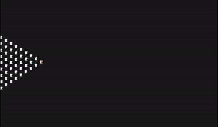
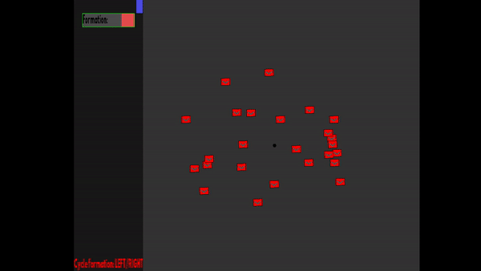
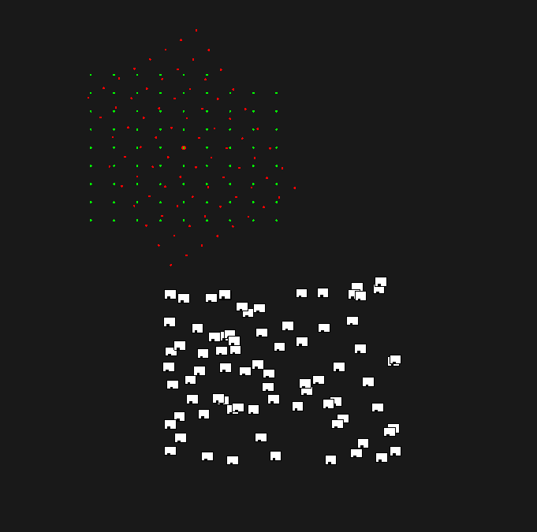

# Formations

Formations for AI in games
# Description
#### Agent 
An Agent can be anything. From a soldier to animals like birds.
Agents can move on their own and have their own statistics like health for example. Depending on their needs agents can perform actions like fighting. 
#### Formation
A formation consists of a group of agents that will move in a synchronized way . Together these agents will form a shape making a formation. The shape of the formation is predefined but changing to another predefined shape is possible. A great example of a formation is the phalanx from the ancient Greeks.When you break down the phalanx to it's basics, it is actually just a rectangle . This is easily implementable and one of the first variations i made. 
# Implementation
All the code is written in c++. A custom framework using sdl and opengl is also implemented. 

#### Creation 
A formation is predefined meaning all the positions that need to be given to the agents are created and saved the moment a group decides to form one. For example: selecting a group of agents and selecting square results in a square being formed on the general postion of these agents. The square will give each position it created a matching agent. 

#### Movement
Base agents have a 2 default actions that can be performed: seeking a target and wandering around. When they are not part of a formation they will wander on their own. When part of a formation they will seek a position given to them by the formation. They will orient themself towards the seeking target unless being told otherwise. 

Base Formations have 1 default actions being seeking a target. The formation have a point being the world position. This is the point that is used when seeking a location. All the formation positions will move in the same way the world position did resulting in coordinated movement.

#### Orientation 
Base agents will orient themself so they look at the target they are facing. This is also true for formations. The difference being that rotating an agent means rotating its body. When rotating a formation, all the positions inside it have to be rotated around another point being the world position. A formation position can however tell the agent it controls to rotate itself .  
# Result

I made some different types of formations wich can all be cycled through. Different agents can be put into different formations. A Debug mode is also present where you can see how a formation behaves without the agents follow it. 

# Conclusion/Future work
Making new formations can be done fairly qucikly as now it just a matter of creating the correct "Grid". Expanding the list is something i will definitely be doing in the future. 

As for now it is also only possible to control a formation one at the time. In a real game this is obviously not fun so this is also a feature i would like to implement. 
While informing myself on this topic i also noticed the topic of pathfinding with formations .I reckoned that this topic is something that has to be implement in the agent itself while my focus was more on the creation of formations. 
While in combat in a real game ,agents often die and have to be replaced. This is my first priority in the future implementation . 
#### Links
https://www.gamasutra.com/view/feature/3314/coordinated_unit_movement.php?print=1

http://www.spronck.net/pubs/Heijden-CIG2008.pdf

#### Insipration

Total War

Age Of Empires
